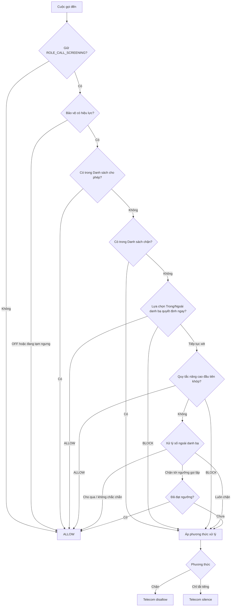

# Kiến trúc chặn cuộc gọi CallHS

Tài liệu này là hợp đồng hiện hành của mô-đun chặn cuộc gọi. Mọi thay đổi model, engine, UI,
backup hoặc service phải giữ đúng thứ tự quyết định và các invariant bên dưới.

## 1. Ba khái niệm không được trộn lẫn

### 1.1. Nguồn số

`MANUAL`, `CONTACT_PICKER`, `CALL_LOG_PICKER` và `LEGACY_MIGRATION` chỉ mô tả nơi người dùng lấy
số. Nguồn không tham gia quyết định runtime.

- Chọn `0901234567` từ Danh bạ tạo một exact entry cho `PhoneKey(0901234567)`.
- Chọn cùng số từ Call Log vẫn là exact entry đó, không tạo “rule Call Log”.
- Snapshot tên và số được giữ cục bộ; ID contact hoặc ID hàng Call Log không được lưu vì không
  portable sang thiết bị khác.
- Một `PhoneKey` chỉ được phép tồn tại ở một danh sách. Chuyển danh sách chạy trong một transaction.

Hai danh sách exact:

| Danh sách | `action` | Ưu tiên |
|---|---|---:|
| Danh sách cho phép | `ALLOW` | cao nhất |
| Danh sách chặn | `BLOCK` | thứ hai |

Nếu dữ liệu cũ/hỏng chứa cả hai action cho cùng `PhoneKey`, `ALLOW` luôn thắng. Export/restore và
thao tác UI canonicalize lại thành một entry duy nhất.

### 1.2. Phạm vi cuộc gọi

`CallBlockScope` là thuộc tính của caller tại thời điểm gọi:

- `SAVED_CONTACT`: chỉ khớp khi `PhoneLookup` xác nhận `IN_CONTACTS`.
- `NOT_SAVED`: chỉ khớp khi xác nhận `NOT_IN_CONTACTS`.
- `ALL_VISIBLE_NUMBERS`: không phụ thuộc kết quả Danh bạ.

`ContactLookupStatus.UNKNOWN` là trạng thái lookup lỗi/timeout/thiếu quyền, không phải scope “số
lạ”. `UNKNOWN` không bao giờ được suy diễn thành `NOT_SAVED`.

### 1.3. Điều kiện

Rule nâng cao gồm:

```text
CallBlockRule
├─ enabled
├─ action: BLOCK | ALLOW
├─ type: PREFIX | SUFFIX | CONTAINS | LENGTH | CARRIER |
│         GEOGRAPHIC | SPECIAL | SPAM_RISK | ...
├─ rawValue / canonical matchValue
├─ scope: SAVED_CONTACT | NOT_SAVED | ALL_VISIBLE_NUMBERS
└─ userOrder
```

`ANY` được dành cho lựa chọn xử lý số trong/ngoài Danh bạ. Các loại legacy `EXACT_NUMBER`,
`CONTACTS` và `CALL_HISTORY` vẫn decode được để migrate/đọc lịch sử cũ nhưng UI v4 không tạo chúng
như conditional rule mới.

## 2. Thứ tự quyết định cố định



Hợp đồng chi tiết:

1. Bảo vệ OFF hoặc pause: cho mọi cuộc gọi qua; dữ liệu vẫn được giữ.
2. Danh sách cho phép: kết thúc ngay bằng `ALLOW`.
3. Danh sách chặn: kết thúc bằng `BLOCK` và dùng phương thức xử lý hiện hành.
4. CallHS xác định số nằm trong hay ngoài Danh bạ rồi áp dụng lựa chọn tương ứng:
   - Trong Danh bạ: **Áp dụng theo quy tắc**, **Luôn cho qua**, hoặc **Chặn toàn bộ**.
   - Ngoài Danh bạ: **Cho qua nếu không khớp quy tắc**, **Chặn toàn bộ**, hoặc
     **Chặn đến khi gọi lặp**.
5. Rule nâng cao được xét theo `userOrder`, rồi `createdAt`, rồi `id`; rule đầu tiên khớp thắng.
6. Xử lý gọi lặp chỉ chạy với lựa chọn tương ứng và khi không có số cụ thể hoặc quy tắc nâng cao nào khớp.
7. Nếu không có mục nào khớp và xử lý gọi lặp không chặn thì mặc định `ALLOW`.

`ALLOW` là kết quả của engine, không còn là một phương thức xử lý toàn cục trong UI. Backup cũ có
`blockMethod=allow` được migrate thành bảo vệ OFF và phương thức `block_and_reject` an toàn để khi
người dùng bật lại không còn trạng thái mơ hồ.

## 3. Xử lý theo Danh bạ

### 3.1. Trong Danh bạ

Ba trạng thái loại trừ nhau:

- **Áp dụng theo quy tắc** (`FOLLOW_ADVANCED`): cuộc gọi tiếp tục được xét theo Quy tắc nâng cao.
- **Luôn cho qua** (`ALLOW`): lưu `ALLOW + ANY + SAVED_CONTACT`.
- **Chặn toàn bộ** (`BLOCK`): lưu `BLOCK + ANY + SAVED_CONTACT`.

Danh sách chặn vẫn được xét trước lựa chọn **Luôn cho qua**. Danh sách cho phép vẫn được xét trước
lựa chọn **Chặn toàn bộ**. Nếu lookup Danh bạ là `UNKNOWN`, rule scope `SAVED_CONTACT` không khớp
và engine tiếp tục theo luồng.

### 3.2. Ngoài Danh bạ

Ba trạng thái loại trừ nhau:

- **Cho qua nếu không khớp quy tắc** (`PASS`): không có `ANY + NOT_SAVED`, xử lý gọi lặp OFF; cuộc gọi
  vẫn được xét theo Quy tắc nâng cao trước khi mặc định cho qua.
- **Chặn toàn bộ** (`BLOCK_ALWAYS`): `BLOCK + ANY + NOT_SAVED`, xử lý gọi lặp OFF.
- **Chặn đến khi gọi lặp** (`BLOCK_UNTIL_REPEAT`): không có rule `ANY + NOT_SAVED`, xử lý gọi lặp ON;
  Quy tắc nâng cao vẫn được xét trước, các lượt đầu chỉ bị chặn khi không có quy tắc nào khớp.

Room và SharedPreferences không có transaction chung. Khi đổi lựa chọn, code luôn tắt cách xử lý cũ
trước rồi mới bật cách xử lý mới; process chết giữa hai bước chỉ có thể tạm thời `PASS`, không thể để
hai bộ chặn chồng lên nhau. Sau restore, nếu merge tạo `BLOCK_ALWAYS` đồng thời xử lý gọi lặp đang bật,
repository canonicalize về `BLOCK_ALWAYS` và reset namespace ledger.

## 4. Rule nâng cao

### 4.1. Action

- `BLOCK`: khi khớp thì dùng `CallBlockMethod`.
- `ALLOW`: cho qua ngay khi quy tắc nâng cao khớp; không ghi lịch sử “đã chặn”.

Danh sách cho phép vẫn có ưu tiên cao hơn rule `ALLOW`. Lựa chọn cho qua/chặn ngay theo Danh bạ
vẫn được áp dụng trước Quy tắc nâng cao.

### 4.2. Scope

Ví dụ:

```text
PREFIX 028 + scope NOT_SAVED + BLOCK
→ chỉ chặn số 028 được xác nhận ngoài Danh bạ

PREFIX +84 + scope ALL_VISIBLE_NUMBERS + BLOCK
→ chặn cả số đã lưu và chưa lưu

CONTAINS 123 + scope SAVED_CONTACT + ALLOW
→ chỉ cho qua contact có chuỗi 123 nếu Danh sách chặn hoặc lựa chọn Chặn toàn bộ chưa xử lý trước
```

Scope được kiểm trước điều kiện provider-dependent. `SAVED_CONTACT` và `NOT_SAVED` fail open khi
lookup `UNKNOWN`; `ALL_VISIBLE_NUMBERS` vẫn hoạt động độc lập.

### 4.3. Các matcher

- `PREFIX`, `SUFFIX`, `CONTAINS`, `LENGTH`: canonical theo chữ số/PhoneKey phù hợp loại matcher.
- `CARRIER`: dataset nhà mạng nằm trong code.
- `GEOGRAPHIC`: mã gọi quốc tế `+`/`00`, preset ngoài `+84`, quốc gia riêng và đầu số Việt Nam
  `024`, họ `022x`, `028`, `059`, `099`.
- `SPECIAL`: chỉ gồm cuộc gọi ẩn số và VoIP best-effort mà OEM thực sự chuyển callback. Hai loại
  callback này luôn dùng `ALL_VISIBLE_NUMBERS`, nên editor không hiển thị scope danh bạ.
- Trạng thái “ngoài danh bạ” không còn là `SPECIAL`: nó được cấu hình duy nhất tại nhóm
  `ANY + NOT_SAVED`, tránh các tổ hợp vô nghĩa như `unknown_contact + SAVED_CONTACT` và tránh hai
  nơi cấu hình cùng một hành vi.
- `SPAM_RISK`: profile cục bộ `app_default`, chỉ hỗ trợ action `BLOCK`; không được tạo hoặc bật tự động khi
  cài đặt, nâng cấp hay restore. Matcher dùng các dấu hiệu: số Việt Nam hoàn chỉnh thuộc nhóm
  `022/023/024/028/059/099`; số di động Việt Nam 10 chữ số dùng đầu số chưa có trong danh mục nhà mạng
  nội bộ của CallHS; hoặc Android
  11+ báo `VERIFICATION_STATUS_FAILED`. `NOT_VERIFIED`, `PASSED`, Android 10 và số sai định dạng không khớp
  riêng vì tín hiệu xác minh.

`SPAM_RISK` là bộ lọc theo dấu hiệu rủi ro, không phải cơ sở dữ liệu số lừa đảo đã được xác nhận. Các họ
`022/023/024/028` là số cố định hợp lệ và `059/099` là số di động Gmobile hợp lệ, nên người dùng phải được
cảnh báo rõ khả năng chặn nhầm trước khi lưu. Danh sách cho phép vẫn là ưu tiên tuyệt đối. Lịch sử lưu lý do
cụ thể bằng codec ổn định thay vì chỉ lưu tên profile chung.

Lý do khớp được ghi theo codec bất biến, không phụ thuộc ngôn ngữ:

| Dấu hiệu thực tế | `ruleType` | `ruleValue` trong history/backup |
|---|---|---|
| Khớp một họ đầu số trong profile | `spam_risk` | `v1\|prefix\|024` |
| Đầu số di động Việt Nam chưa có trong danh mục CallHS | `spam_risk` | `v1\|unknown_mobile_prefix\|054` |
| Android/nhà mạng báo xác minh số gọi thất bại | `spam_risk` | `v1\|verification_failed` |

Rule đang hoạt động vẫn lưu `rawValue=matchValue=app_default`; chỉ sự kiện lịch sử lưu lý do cụ thể. Codec
chỉ nhận đúng version/kind/payload đã biết, vì vậy dữ liệu hỏng không bị hiển thị như một kết luận hợp lệ.

Caller ID có thể bị giả mạo. Mã gọi/đầu số chỉ so khớp số Android cung cấp, không xác minh vị trí,
danh tính, nhà mạng hiện tại hoặc kết luận gian lận.

## 5. Xử lý số ngoài Danh bạ gọi lặp

Xử lý gọi lặp chỉ chạy sau khi không có danh sách số hoặc Quy tắc nâng cao nào khớp và chỉ khi
`PhoneLookup` xác nhận `NOT_IN_CONTACTS`.

- Ngưỡng: 2, 3 hoặc 4.
- Cửa sổ: 1–1.440 phút.
- Lượt hiện tại được tính trước khi quyết định.
- Lượt `1..threshold-1` tạo match synthetic và dùng phương thức xử lý.
- Từ lượt `threshold` trở đi được cho qua trong khi cửa sổ trượt vẫn đủ ngưỡng.
- `IN_CONTACTS`, `UNKNOWN`, private/VoIP, caller ID không hợp lệ, event ID thiếu, storage lỗi hoặc
  config đổi giữa callback đều fail open.
- Ledger dedupe theo event creation time, giới hạn 256 số và tối đa 4 mốc/số.

Lý do history synthetic dùng storage contract:

```text
ruleType  = repeat_unknown_caller_guard
ruleValue = v1|attempt|threshold|windowMinutes
```

Ledger và `sessionGeneration` không backup. Tắt/bật lại hoặc restore `UPDATE/REPLACE` tạo namespace
mới nên không kế thừa lượt cũ.

## 6. Bảo vệ, pause và phương thức xử lý

### 6.1. Master protection

`baseEnabled=false` là tắt lâu dài. Khi tắt, mọi danh sách số, lựa chọn xử lý theo Danh bạ, Quy tắc
nâng cao và xử lý gọi lặp đều không được áp dụng.

Pause dùng khoảng nửa kín `[pauseStartedAt, pauseUntil)` và các preset 10 phút, 30 phút, 1 giờ.
Hết hạn tự trở về bảo vệ ON. Chọn tab `Tắt` dưới timer chỉ huỷ pause; công tắc chính mới tắt bảo vệ
lâu dài. Tắt lâu dài xoá timer.

Pause dựa wall clock để tồn tại qua process/reboot. Timestamp hết hạn hoặc ở tương lai bị xoá; nếu
người dùng chỉnh đồng hồ lùi nhưng vẫn còn trong khoảng hợp lệ, pause có thể dài thêm phần đã chỉnh.

### 6.2. CallBlockMethod

UI chỉ có ba phương thức:

| Method | disallow | reject | silence | Ghi history/notification |
|---|---:|---:|---:|---|
| `BLOCK_AND_REJECT` | true | true | false | Có |
| `BLOCK_WITHOUT_REJECT` | true | false | false | Có |
| `SILENCE_ONLY` | false | false | true | Không |

`SILENCE_ONLY` không được gọi là “đã chặn” và không tăng count lịch sử.

## 7. CallScreeningService và deadline

- Chỉ cuộc gọi đến được đánh giá; outgoing luôn allow.
- Watchdog 4 giây dùng `ScheduledExecutorService` riêng và được lên lịch trước mọi đọc prefs/Room/provider.
- Matcher chạy ngoài Main. Watchdog và matcher dùng một `AtomicBoolean`; kết quả tới sau watchdog
  không được gửi response, ghi history hoặc báo “đã chặn”.
- `CallScreeningService` yêu cầu phản hồi trong 5 giây từ `onScreenCall`; 1 giây còn lại dành cho
  scheduling/Binder.
- Trước response BLOCK, service đọc lại protection, method, snapshot generation và guard generation.
  Setting/rule bị đổi giữa lúc lookup không được phép dùng kết quả cũ.
- Contacts lookup có `CancellationSignal`, timeout 450 ms và executor daemon giới hạn. `UNKNOWN`
  được xử lý theo scope và quy tắc gọi lặp như mô tả trên.
- Rule snapshot v2 lưu đủ `action`, `scope`, `userOrder`; payload v1 bị reject vì thiếu các trường quyết định.
- Room vẫn là nguồn sự thật. Snapshot trusted được invalid trước mutation và publish sau commit; generation
  ngăn snapshot cũ được phát lại.

Exact entry dùng indexed Room lookup dưới cùng mutation barrier. MainActivity warm Room/rule snapshot nền;
cold process vẫn có watchdog fail open nếu thiết bị giữ DB quá 4 giây.

## 8. Notification đáng tin cậy

Chế độ người dùng chỉ còn:

- `off`
- `every` — báo mỗi cuộc thực sự bị chặn.

Storage legacy `every_5`/`every_10` được đọc thành `every`; UI và export v4 không còn hai lựa chọn này.

Channel hiện hành:

```text
id          = blocked_calls_urgent_sound_v3
importance  = IMPORTANCE_HIGH
priority    = PRIORITY_MAX
category    = CALL
sound       = android.resource://<package>/raw/call_blocked_alert
vibration   = [0, 180, 90, 260]
```

Phải dùng channel ID mới vì Android không cho app nâng importance/đổi sound của channel đã tạo. Các channel
cũ `blocked_calls` và `blocked_calls_urgent_v2` bị xoá.

Sau khi `respondToCall` thành công, service đăng notification ngay lập tức trước Room. Android sở hữu
notification này kể cả Telecom unbind và process bị thu hồi. Sau khi Room ghi xong, app update cùng event ID
với count chính xác; `setOnlyAlertOnce(true)` ngăn âm/rung lần hai. Nếu permission, app notification, channel
hoặc sound bị người dùng/OEM tắt, UI hiển thị trạng thái và mở đúng trang channel settings. App không thể
cưỡng chế DND hoặc tuỳ chọn floating notification của OEM.

## 9. Room schema phát triển v1

Các bảng app-owned:

- `call_block_number_entries`: unique `(action, phoneKey)`, origin chỉ là provenance.
- `call_block_rules`: unique `(action, type, matchValue, scope)`, có `userOrder`.
- `call_block_history`: lưu raw reason/scope tại thời điểm xử lý, tối đa 1.000 hàng.

Ứng dụng chưa public nên cấu trúc mới nhất được định nghĩa trực tiếp là Room `version = 1`. Dự án chỉ xuất
`app/schemas/.../1.json` hiện tại và chưa chứa migration hay schema lịch sử. Khi thay đổi cấu trúc trong giai
đoạn phát triển, dữ liệu cài thử được xoá/tạo mới thay vì chuyển đổi qua nhiều version.

## 10. Backup JSON v4

Section `callBlockRules`:

```json
{
  "enabled": true,
  "notificationMode": "every",
  "blockMethod": "block_and_reject",
  "repeatUnknownCallerGuardEnabled": false,
  "repeatUnknownCallerGuardThreshold": 2,
  "repeatUnknownCallerGuardWindowMinutes": 15,
  "numberEntries": [
    {
      "action": "allow",
      "rawNumber": "0901234567",
      "phoneKey": "901234567",
      "displayName": "An",
      "origin": "contact_picker",
      "enabled": true,
      "createdAt": 0
    }
  ],
  "rules": [
    {
      "type": "prefix",
      "rawValue": "028",
      "matchValue": "028",
      "enabled": true,
      "createdAt": 0,
      "action": "block",
      "scope": "not_saved",
      "userOrder": 0
    }
  ]
}
```

Quy tắc:

- V4 không tin serialized `phoneKey`/`matchValue`; luôn canonicalize lại.
- V4 reject toàn section nếu một rule/entry có action, scope, type hoặc payload sai, tránh REPLACE một phần.
  Ngoại lệ tương thích duy nhất là row legacy đúng canonical
  `repeat_unanswered + rawValue/matchValue=5 + action BLOCK/ALLOW hợp lệ + scope hợp lệ`: parser bỏ riêng row này và
  vẫn khôi phục các rule hợp lệ còn lại. Row legacy sai hình dạng hoặc type lạ vẫn làm section bị từ chối.
- Exact overlap canonicalize `ALLOW` thắng.
- Hai action `ANY` đang bật cùng scope hoặc `BLOCK_ALWAYS` đồng thời xử lý gọi lặp ON là payload không hợp lệ.
- `ADD` giữ lựa chọn xử lý theo Danh bạ hiện tại; `UPDATE` thay action đối nghịch cùng scope;
  `REPLACE` thay toàn bộ.
- Backup v1–v3 được adapter: source rules nổ thành exact entries; ngoại lệ Danh bạ toàn cục thành
  `ALLOW + ANY + SAVED_CONTACT`;
  method `allow` thành protection OFF; cadence 5/10 thành `every`.
- Backup không xuất pause, ledger hoặc session generation.
- `UPDATE/REPLACE` reset guard namespace trước khi publish rule mới; `ADD` giữ ledger trừ khi merge tạo
  `BLOCK_ALWAYS`, lúc đó canonicalization tắt guard.
- `blockedCalls` là lịch sử app-owned, không phải bản sao Call Log hệ thống.
- Export không bao giờ ghi lại rule `repeat_unanswered`; lịch sử cũ mang reason này vẫn được xuất/khôi phục
  nguyên trạng để người dùng tiếp tục tra cứu, nhưng không thể kích hoạt lại rule đã loại bỏ.
- Android Auto Backup loại runtime pause/ledger và file `.bak`; durable settings đi cùng Room để tránh
  partial restore bật blocker sai.

## 11. UI được duyệt

### Màn chính

- Top bar: back, title, icon settings.
- Ngay dưới title: `Segmented` hai tab Quy tắc/Lịch sử.
- Tab Quy tắc có card **Tìm hiểu cách CallHS chặn cuộc gọi**, bốn card quản lý:
  **Danh sách cho phép**, **Danh sách chặn**, **Xử lý theo danh bạ**, **Quy tắc nâng cao**, và card hỗ trợ
  **Các vấn đề thường gặp** nằm cuối danh sách.
- Card hướng dẫn luôn rõ và mở được ngay cả khi bảo vệ đang tắt; card này không hiển thị số lượng rule.
- Khi protection OFF/pause, banner đỏ hiển thị và các card/rule giảm alpha; dữ liệu vẫn quản lý được.
- Tab Lịch sử giữ item, detail và `ContextMenuOverlay` chuẩn `ListCallItem`.

### Hướng dẫn quy trình

Card **Tìm hiểu cách CallHS chặn cuộc gọi** có mô tả “Xem thứ tự CallHS kiểm tra và xử lý một cuộc
gọi đến”, rồi mở `AppBottomSheet` **Cách CallHS xử lý cuộc gọi**. Sheet mở đầu bằng câu “CallHS kiểm
tra lần lượt theo thứ tự dưới đây và dừng ngay khi đã có kết quả”, sau đó trình bày đúng sáu bước:

1. **Kiểm tra bảo vệ cuộc gọi** — Nếu bảo vệ đang tắt hoặc tạm dừng, mọi cuộc gọi đều được cho qua.
2. **Kiểm tra Danh sách cho phép** — Số có trong Danh sách cho phép được cho qua ngay.
3. **Kiểm tra Danh sách chặn** — Nếu số có trong Danh sách chặn, cuộc gọi sẽ bị chặn.
4. **Xử lý theo danh bạ** — CallHS áp dụng lựa chọn dành cho số trong hoặc ngoài Danh bạ. Chọn
   **Áp dụng theo quy tắc** để tiếp tục bước kế tiếp.
5. **Kiểm tra Quy tắc nâng cao** — CallHS xét từ trên xuống. Quy tắc đầu tiên khớp sẽ được áp dụng.
6. **Áp dụng kết quả mặc định** — Nếu không có danh sách hay quy tắc nào khớp, cuộc gọi được cho qua.
   Chế độ gọi lặp chỉ áp dụng ở bước cuối cho số ngoài Danh bạ.

Dòng kết luận của sheet là “Danh sách cho phép luôn có ưu tiên cao nhất”.

Sheet dùng `PanelCard`/row theo theme hiện hành, icon chỉ trang trí có `contentDescription=null`, và
thứ tự đọc TalkBack phải theo đúng thứ tự sáu bước.

### Danh sách số cụ thể

- Nút Thêm số mở `AppBottomSheet`: nhập tay, chọn Danh bạ, chọn Call Log.
- Picker Danh bạ/Call Log chỉ trả snapshot số; ViewModel upsert từng exact entry.
- Chuyển giữa **Danh sách cho phép** và **Danh sách chặn** là thao tác atomic, không tạo trùng.
- Nhấn giữ item: chuyển danh sách, bật/tắt hoặc xoá.

### Xử lý theo Danh bạ

- Hai `PanelCard` là **Trong danh bạ** và **Ngoài danh bạ**. Card hiển thị đầy đủ lựa chọn hiện tại
  cùng mô tả kết quả; không dùng `Segmented` cho ba lựa chọn này.
- Nhấn card mở `AppBottomSheet`; mỗi lựa chọn dùng `FilterOptionRow`, hiển thị đầy đủ nhãn và mô tả,
  có dấu tick cho lựa chọn hiện tại và chọn xong thì sheet đóng.
- **Trong danh bạ** có: **Áp dụng theo quy tắc**, **Luôn cho qua**, **Chặn toàn bộ**.
- **Ngoài danh bạ** có: **Cho qua nếu không khớp quy tắc**, **Chặn toàn bộ**,
  **Chặn đến khi gọi lặp**.
- Không rút gọn nhãn trên card hoặc trong sheet. TalkBack phải đọc được tên nhóm, lựa chọn hiện tại và
  trạng thái đã chọn.
- Cấu hình gọi lặp chỉ hiện ngưỡng 2/3/4 và input phút khi **Chặn đến khi gọi lặp** được chọn.
- Khi protection không hiệu lực, controls disabled/giảm alpha và tự bật lại khi pause hết hạn.

### Advanced rules

- Editor theo `CategoryEditorScreen`: top bar/insets, viewport cuộn, save bar theo IME/navigation bars.
- Chọn action và scope rõ ràng. `SPECIAL` là single-select: private, SIP URI có user là số điện
  thoại, hoặc SIP URI có user dạng text; `BRAND_NAME` là một advanced type độc lập và không có
  Contacts scope.
- Private luôn có scope `ALL_VISIBLE_NUMBERS` và ẩn “Kiểm tra số nào?” vì không có số để tra danh
  bạ. SIP-phone tách toàn bộ user trước `@`, dùng phần đó cho number rules và Contacts scope;
  SIP-text luôn `ALL_VISIBLE_NUMBERS`, không bao giờ trích riêng các chữ số nằm trong text.
- Chỉ scheme `sip:`/`sips:` với user và host hợp lệ được phân loại. URI khác hoặc sai định dạng fail
  open. Brandname khớp CNAM chính xác, phân biệt hoa/thường và tối đa 5 tên mỗi quy tắc; CLI dạng
  `tel:` tiếp tục do number rules xử lý. Tên người dùng lưu trong Contacts là `contactDisplayName`,
  tách biệt với CNAM/`callerDisplayName`, nên Brandname luôn dùng scope `ALL_VISIBLE_NUMBERS` và ẩn
  “Kiểm tra số nào?”.
- Cú pháp user/host và `user=phone` theo [RFC 3261](https://www.rfc-editor.org/rfc/rfc3261.html);
  `tel:` theo [RFC 3966](https://www.rfc-editor.org/rfc/rfc3966.html). Android chuẩn chỉ chuyển
  `tel:` vào [`CallScreeningService`](https://developer.android.com/reference/android/telecom/CallScreeningService).
  Callback chuẩn cũng không liệt kê `callerDisplayName` trong các trường được cung cấp; vì vậy SIP
  và Brandname đều là best-effort trên OEM có mở rộng callback.
- Quy tắc đầu tiên khớp thắng. Nhấn giữ để lên/xuống, bật/tắt hoặc xoá.
- Sheet dùng `AppBottomSheet`; row chọn dùng `FilterOptionRow`; card dùng `PanelCard`. Chỉ tab chính
  và các lựa chọn ngưỡng ngắn phù hợp mới dùng `Segmented`.
- Mọi text nằm trong `CallBlockStrings` và có Việt/Anh; storage key không dịch.

### Các vấn đề thường gặp

- Card **Các vấn đề thường gặp** mở một destination riêng, không thay đổi cấu hình chỉ vì người dùng mở màn.
- Màn hướng dẫn hiển thị bảy triệu chứng dạng mở rộng/thu gọn: bộ chặn không hoạt động, cuộc gọi vẫn lọt
  qua, chặn nhầm số quan trọng, không có notification, notification không âm/rung/heads-up, thiếu lịch sử,
  và giới hạn với số ẩn/VoIP/brandname.
- Mỗi mục tách rõ **Nguyên nhân có thể** và **Cách khắc phục**. Các mục liên quan có shortcut tới cài đặt
  chặn cuộc gọi hoặc kênh notification của Android; shortcut không tự ý thay đổi lựa chọn của người dùng.
- Hướng dẫn phải phản ánh đúng thứ tự ưu tiên rule, sự khác nhau giữa block/silence/allow, lịch notification,
  force-stop/direct boot và giới hạn `CallScreeningService`; mọi text có đủ Việt/Anh trong `CallBlockStrings`.

### Nguồn và giới hạn của profile spam

- Tài liệu [`Call.Details.getCallerNumberVerificationStatus()`](https://developer.android.com/reference/android/telecom/Call.Details#getCallerNumberVerificationStatus())
  của Android định nghĩa `VERIFICATION_STATUS_FAILED` là tín hiệu số có thể bị giả mạo hoặc không mong muốn;
  `NOT_VERIFIED` chỉ có nghĩa là không có thông tin và phải fail open trong CallHS.
- Bộ TT&TT mô tả các họ mã vùng cố định sau chuyển đổi, trong đó có
  [`022x`, `023x`, `024` và `028`](https://english.mic.gov.vn/dialling-codes-to-change-from-feb-2017-197133361.htm).
  Đây là đầu số hợp lệ, không phải nhãn lừa đảo.
- `059` và `099` là đầu số di động hợp lệ của Gmobile; xem
  [thông báo chính thức của Gmobile](https://gmobile.vn/thong-bao-cap-nhat-cac-goi-cuoc-sau-khi-nang-cap-he-thong).
- Kênh chính thức [`156/5656`](https://mic.gov.vn/bo-tttt-trien-khai-tong-dai-156-tiep-nhan-phan-anh-tin-nhan-rac-cuoc-goi-rac-cuoc-goi-co-dau-hieu-lua-dao-197155742.htm)
  tiếp nhận phản ánh để nhà mạng xác minh. CallHS không tuyên bố profile cục bộ là bản sao của một danh sách
  số lừa đảo đã được xác nhận và hiện không tự gửi dữ liệu người dùng tới các tổng đài này.

### Settings riêng

- Chỉ chứa: Bảo vệ/pause, Phương thức xử lý, Notification.
- Notification sheet chỉ có OFF/EVERY.

## 12. File chính

```text
data/blocking/
├─ CallBlockModels.kt
├─ CallBlockDao.kt
├─ CallBlockRepository.kt
├─ CallBlockRuleSnapshot.kt
├─ CallBlockSettings.kt
├─ RepeatUnknownCallerBypass.kt
├─ CallBlockScreeningService.kt
├─ CallBlockNotifier.kt
└─ CallScreeningRole.kt

ui/blocking/
├─ CallBlockScreen.kt
├─ CallBlockCommonIssuesScreen.kt
├─ CallBlockArchitectureScreens.kt
├─ CallBlockRuleEditorScreen.kt
├─ CallBlockContactPickerScreen.kt
├─ CallBlockCallHistoryPickerScreen.kt
├─ CallBlockViewModel.kt
└─ CallBlockRuleEditorViewModel.kt
```

## 13. Checklist bắt buộc

1. Storage key ổn định, không phụ thuộc locale.
2. Matcher/codec deterministic và có unit test.
3. Scope contact không được coi lookup `UNKNOWN` là `NOT_SAVED`.
4. Danh sách cho phép và Danh sách chặn không được đồng thời chứa cùng một PhoneKey.
5. Các lựa chọn xử lý theo Danh bạ loại trừ nhau; xử lý gọi lặp không được vượt qua bất kỳ rule nào đã khớp.
6. Thay đổi action/scope/order phải invalid/publish snapshot và final generation check.
7. Chỉ `disallowCall=true` ghi lịch sử “đã chặn”.
8. Notification đầu tiên phải đăng sau Telecom response nhưng trước Room; update không alert lần hai.
9. Trước khi public, entity mới phải cập nhật trực tiếp schema export v1; không thêm version/migration lịch sử.
10. Backup parser/export/restore, i18n Việt/Anh và tài liệu phải được cập nhật cùng feature.
11. Chạy tối thiểu:

```bash
./gradlew :app:testDebugUnitTest :app:assembleDebug :app:assembleDebugAndroidTest
```

## 14. Giới hạn Android

- [`CallScreeningService`](https://developer.android.com/reference/android/telecom/CallScreeningService)
  yêu cầu response trong 5 giây. AOSP chỉ chuyển handle `tel` có presentation cho phép; hidden/restricted,
  unavailable/payphone và non-tel/VoIP thông thường không tới app.
- Để nhận callback cho số đã lưu, app cần `READ_CONTACTS`; thu hồi/auto-reset quyền làm giảm độ phủ.
- [`NotificationChannel`](https://developer.android.com/develop/ui/compose/notifications/channels) có
  importance/sound bất biến sau tạo; Android 13+ cần `POST_NOTIFICATIONS`.
- Service chưa `directBootAware`: trước lần mở khoá đầu tiên sau reboot, credential-protected Room/settings
  chưa sẵn sàng. Không được bật cờ nửa vời khi chưa mirror đủ state.
- Force-stop, hibernation, mất role, DND và chính sách OEM nằm ngoài quyền cưỡng chế của ứng dụng.
- History hậu xử lý vẫn best effort nếu Android giết toàn bộ process ngay sau response; notification được
  đăng trước Room để không phụ thuộc cửa sổ này.
