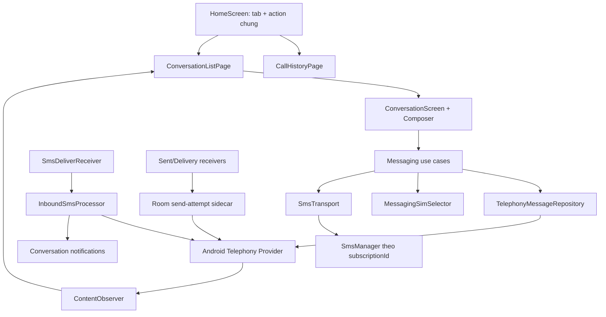

# Kế hoạch tích hợp SMS mặc định vào MCAS

> Trạng thái: **Phase 1 SMS text + Phase 2 MMS ảnh đã được triển khai trong mã nguồn**; cần matrix thiết bị/SIM thật trước phát hành rộng
>
> Ngày rà soát: 2026-08-29
>
> Phạm vi hiện tại: SMS text và MMS một người nhận (ảnh + caption + subject), đa SIM, Provider, callback và UI hội thoại

## 0. Mốc triển khai Phase 1

Đã hoàn thành trong mã nguồn ngày 2026-08-28:

- Home có tab **Cuộc gọi / Nhắn tin**, vuốt ngang hoặc chạm tab với animation; QR, Danh bạ, Tìm kiếm và
  Cài đặt vẫn là action dùng chung.
- Đủ bộ component/permission để yêu cầu `ROLE_SMS`; role và các quyền SMS lõi được đưa vào onboarding toàn
  màn hình cùng các quyền quan trọng. Quyền MMS/WAP vẫn được khai báo nhưng không được phép khóa SMS text.
- Đọc/ghi Telephony SMS Provider, danh sách hội thoại, unread, tìm kiếm, màn hội thoại, nháp, xóa/đọc/chưa
  đọc, composer IME-aware, SMS dài và chọn SIM bằng `subscriptionId`.
- Gửi thật qua `SmsManager`, ledger từng segment, callback sent/delivery, lỗi không tự retry; nhận
  `SMS_DELIVER`, chống xử lý trùng, ghi Inbox và notification riêng tư có trả lời nhanh/đánh dấu đã đọc.
- Hỗ trợ `sms:`, `smsto:`, notification deep link và `RESPOND_VIA_MESSAGE`; ở Phase 1, payload nhiều người
  nhận/MMS từng bị chặn rõ ràng thay vì âm thầm gửi sai loại.
- Sidecar Room chứa nội dung nhạy cảm đã bị loại khỏi Auto Backup/device transfer mặc định; nội dung đồng ý
  quyền riêng tư và README đã được cập nhật đúng khả năng ghi SMS.

## 0.1. Mốc triển khai Phase 2 — MMS ảnh

Đã hoàn thành trong mã nguồn ngày 2026-08-29:

- Codec MMS 1.2 riêng, giới hạn PDU/part/MIME và unit test; không gọi API ẩn `com.google.android.mms`, không
  reflection và không log PDU/nội dung thô.
- `WAP_PUSH_DELIVER` parse `notification.ind`, chống trùng theo transaction ID, lưu placeholder vào MMS
  Provider, tải bằng `SmsManager` của đúng `subscriptionId`, parse `retrieve.conf` và ghi text/image part.
- Tải tự động khi không roaming, tùy chọn tắt tự tải/tự tải roaming trong Cài đặt, tải thủ công và retry ngay
  trong bubble; callback giữ result/HTTP status ở Room và dọn PDU tạm/quyền URI sau trạng thái cuối.
- Photo Picker không cần quyền bộ nhớ; ảnh được đọc có chặn kích thước giải nén, áp orientation qua
  `ImageDecoder`, bỏ metadata khi re-encode JPEG và nén theo max size/width/height từ carrier config.
- Gửi ảnh + caption + subject bằng MMS qua đúng SIM, luôn hiện xác nhận kênh dữ liệu/khả năng tính phí;
  Outbox/Sent/Failed và part được lưu trong Telephony MMS Provider.
- Hội thoại hợp nhất SMS/MMS theo `threadId`; thumbnail, xem ảnh toàn màn hình, trạng thái tải/lỗi, xóa/đọc
  và observer Provider hoạt động cho cả hai transport. FileProvider chỉ mở ba thư mục cache con riêng.

Release gate còn lại: phải chạy matrix thiết bị thật với ít nhất các SIM/nhà mạng mục tiêu, gồm gửi/nhận qua
Wi-Fi bật, dữ liệu di động tắt, roaming, APN lỗi, callback sau process death và PDU do các OEM khác nhau tạo.
Group MMS, vị trí, danh thiếp và quản lý nâng cao vẫn thuộc Phase 3–4, không được xem là đã hỗ trợ.

## 1. Kết luận và các quyết định đã chốt

MCAS có thể trở thành ứng dụng SMS mặc định thực thụ vì dự án đang dùng `minSdk 29`, `targetSdk 36`
và Jetpack Compose. Tuy nhiên đây không chỉ là thêm một màn hình nhắn tin. Khi giữ `ROLE_SMS`, MCAS phải
tự nhận tin đến, tự ghi tin đến/tin đi vào Telephony Provider, xử lý callback gửi, notification và các intent
hệ thống. Nếu một mắt xích không hoạt động, người dùng có thể không nhìn thấy tin nhắn hoặc gửi trùng SMS.

Các quyết định kiến trúc cho MCAS:

1. Màn chính có thanh tab **Cuộc gọi / Nhắn tin** thay vị trí chữ **Lịch sử cuộc gọi**. Cụm nút QR,
   Danh bạ, Tìm kiếm và Cài đặt vẫn đứng yên; hành vi tìm kiếm thay đổi theo tab đang chọn.
2. Nội dung hai tab chuyển bằng pager ngang, hỗ trợ cả chạm tab và vuốt. Indicator và nội dung chạy đồng bộ,
   có slide nhẹ kết hợp fade; vị trí cuộn, bộ lọc và truy vấn của từng tab được giữ riêng.
3. Giai đoạn đầu chỉ cho soạn/gửi **SMS text tới một người nhận**. Không âm thầm đổi sang MMS và không cho
   chọn ảnh, vị trí, danh thiếp hoặc nhóm người nhận trong UI giai đoạn này.
4. Dùng **Telephony SMS/MMS Provider làm nguồn dữ liệu chính**. Không sao chép toàn bộ hộp thư vào Room.
   Room chỉ giữ dữ liệu riêng của MCAS: bản nháp, SIM ưu tiên của hội thoại, dữ liệu tổng hợp callback gửi
   và fingerprint chống xử lý trùng.
5. Chọn SIM bằng `subscriptionId`, không dùng nhãn `SIM 1`/`SIM 2` hoặc `slotIndex` làm khóa. `SimScope`
   hiện tại chỉ phục vụ phạm vi xem nhật ký cuộc gọi và tuyệt đối không được tái sử dụng để quyết định SIM gửi.
6. Không tự retry SMS. Chỉ người dùng mới được bấm thử lại sau khi thấy lỗi, vì retry nền có thể gửi trùng
   và tính cước lần nữa.
7. Mọi text mới phải có cả tiếng Việt và tiếng Anh qua hợp đồng `AppStrings`; mọi màu và typography lấy từ
   theme hiện có.
8. Chưa tách nhiều Gradle module ở giai đoạn đầu. Dự án hiện là một module `app`; tách package rõ trước,
   chỉ tách module sau khi luồng SMS đã ổn định để giảm rủi ro build và migration.

### Thế nào là “SMS mặc định thực thụ” trong phạm vi này

Chỉ coi là hoàn thành khi MCAS:

- Đủ điều kiện để hệ thống hiển thị trong hộp chọn ứng dụng SMS mặc định và người dùng tự xác nhận.
- Đọc được lịch sử SMS hiện có sau khi giữ role.
- Gửi SMS ngắn/dài, Unicode/GSM-7 bằng đúng SIM và tự ghi tin đi vào Telephony Provider.
- Nhận SMS khi app đang mở, ở nền và khi tiến trình đã bị hệ thống dừng; tự ghi tin đến vào Provider.
- Hiển thị hội thoại, unread, trạng thái gửi/thất bại và notification đúng conversation.
- Nhận `sms:`, `smsto:`, `mms:`, `mmsto:` từ ứng dụng khác và xử lý `RESPOND_VIA_MESSAGE`.
- Ngừng đọc/gửi/nhận qua các API nhạy cảm ngay khi MCAS không còn giữ `ROLE_SMS`.
- Không làm mất dữ liệu khi đổi sang ứng dụng SMS mặc định khác, vì dữ liệu chính nằm trong Provider hệ thống.

## 2. Kết quả rà soát dự án hiện tại

### 2.1. Những nền tảng có thể tái sử dụng

| Khu vực hiện tại | Có thể tái sử dụng cho SMS |
|---|---|
| `MainActivity` | Edge-to-edge, đồng bộ status/navigation bar, theme động |
| `AppNav` | Kiểu transition ngang khi vào màn chi tiết và mô hình ViewModel dùng chung theo graph |
| `CallListScreen` | Top bar, tìm kiếm, QR flow, FAB, danh sách, pull-to-refresh, context menu, xử lý inset |
| `ui/theme` | Toàn bộ palette sáng/tối, typography, font scale và token màu |
| `AppBottomSheet`, `AppDialog`, `ContextMenuOverlay` | Chọn SIM, xác nhận xóa, menu tin nhắn/hội thoại |
| `SimInfo` | Đọc SIM đang hoạt động và snapshot tên SIM/nhà mạng/slot/subscription ID |
| `ContactsRepository`, `PhoneKey` | Chọn người nhận, hiện tên/ảnh, chuẩn hóa số để tra danh bạ |
| `SmsSettings`, `SmsText` | Tùy chọn bỏ dấu trước khi gửi, nhưng không dùng để tính số segment |
| i18n Việt/Anh | Mở rộng hợp đồng cho toàn bộ UI và lỗi gửi SMS |
| Room hiện tại | Tái sử dụng conventions/DAO pattern; sidecar SMS nên ở DB riêng để loại khỏi auto backup |

### 2.2. Khoảng trống bắt buộc phải bổ sung

- Manifest chưa có permission SMS/MMS và chưa có bốn loại component để đủ điều kiện nhận `ROLE_SMS`.
- Chưa có route hội thoại/soạn tin, repository Telephony, `ContentObserver`, transport gửi, receiver nhận,
  receiver callback sent/delivery, notification nhắn tin hoặc service trả lời khi từ chối cuộc gọi.
- `CallListScreen` đang sở hữu cả top bar, QR flow, tìm kiếm, nội dung và FAB trong một file lớn. Phải tách
  “khung màn chính dùng chung” trước khi chèn tab Nhắn tin, nếu không logic hai tính năng sẽ móc chéo nhau.
- `PermissionGate` toàn màn hình cần giữ lại phong cách onboarding gốc nhưng mở rộng thành một state machine
  tuần tự, bổ sung bước SMS composite và chuyển bước chấp nhận Điều khoản xuống cuối luồng.
- Nội dung quyền riêng tư/README hiện nói MCAS “chỉ đọc” và “không tạo tin nhắn”. Nội dung này sẽ sai ngay
  khi tính năng mới hoạt động và phải được cập nhật cùng lúc với mã.
- Backup tự động hiện chưa loại trừ bản nháp và ledger gửi SMS. Nội dung nhạy cảm mới phải được loại khỏi
  cloud backup/device transfer mặc định, trừ khi sau này có một lựa chọn backup rõ ràng do người dùng bật.

### 2.3. Các điểm cần hiệu chỉnh so với tài liệu đầu vào

Tài liệu đầu vào định hướng đúng, nhưng khi áp dụng vào MCAS cần bổ sung các điểm sau:

1. `SmsManager.createForSubscriptionId()` chỉ có từ API 31, trong khi MCAS hỗ trợ API 29. API 29–30 phải
   đi qua lớp tương thích dùng `SmsManager.getSmsManagerForSubscriptionId()`; tầng UI/domain không được tự
   phân nhánh theo phiên bản Android.
2. Bước SMS được tích hợp vào `PermissionGate`, nhưng phải là một bước composite: xin `ROLE_SMS` **trước**,
   kiểm tra role thật khi quay lại, rồi mới xin ba quyền SMS text lõi còn thiếu. `RECEIVE_MMS` và
   `RECEIVE_WAP_PUSH` là capability bổ sung: thiếu chúng không được khóa toàn ứng dụng. Thiết bị không có
   `FEATURE_TELEPHONY_MESSAGING` bỏ qua toàn bộ bước composite này.
3. Khi MCAS là ứng dụng SMS mặc định, hệ thống không tự ghi tin gửi bởi `SmsManager` vào Provider;
   MCAS phải tạo/cập nhật bản ghi Outbox/Sent/Failed.
4. Không nên tự viết bộ đếm ký tự dựa trên giả định “ASCII = GSM-7”. Một số ký tự GSM extension tốn hai
   septet. Preview số phần và transport phải dùng `SmsMessage.calculateLength()`/`SmsManager.divideMessage()`.
5. Khai báo `WAP_PUSH_DELIVER` chỉ để đủ role nhưng bỏ trống receiver có thể làm người dùng bỏ lỡ MMS.
   Text-only là phạm vi phát triển hợp lý, nhưng chưa phải mốc phát hành rộng an toàn nếu chưa có sàn bảo vệ MMS.
6. Các tên `Conversation`, `Message`, `MessagePart` trong tài liệu nên là **domain model** đọc từ Provider,
   không phải toàn bộ Room entities. Nếu lưu song song sẽ tạo hai nguồn dữ liệu dễ lệch trạng thái.

## 3. Đặc tả UX/UI giai đoạn đầu

### 3.1. Khung màn chính

Tạo `HomeScreen` làm chủ top bar, pager và các action dùng chung. `CallListScreen` được tách thành nội dung
`CallHistoryPage`; hành vi cuộc gọi hiện có phải giữ nguyên trước khi thêm dữ liệu SMS.

```text
┌──────────────────────────────────────────────────────────┐
│ [ Cuộc gọi | Nhắn tin ]   QR  Danh bạ  Tìm kiếm  Cài đặt │
├──────────────────────────────────────────────────────────┤
│                                                          │
│      Trang Cuộc gọi              Trang Nhắn tin          │
│      (UI hiện tại)        ↔      (hội thoại SMS)          │
│                                                          │
│                                               [ FAB ]    │
└──────────────────────────────────────────────────────────┘
```

- Tab là segmented control bo tròn, dùng `TabSelectedBg`, `TabSelectedText`, `TabText` và `Primary` hiện có.
- Màu bong bóng/trạng thái mới phải được thêm thành token cho cả `LightPalette` và `DarkPalette`, có kiểm tra
  tương phản; không hard-code màu trực tiếp trong composable nhắn tin.
- Từ 360 dp trở lên, tab và icon cùng một hàng. Ở chiều rộng nhỏ hơn hoặc khi font nội bộ làm nhãn không đủ
  chỗ, top bar chuyển thành hai hàng (icon chung ở trên, tab đủ rộng ở dưới), không ẩn icon hay cắt chữ.
- `HorizontalPager` có hai page cố định. Chạm tab gọi `animateScrollToPage`; vuốt page cập nhật indicator.
- Chuyển trang dùng chuyển động khoảng 260–300 ms, easing mềm, slide theo đúng hướng và fade nhẹ. Không scale
  toàn trang và không animate các icon chung để mắt người dùng luôn có điểm neo ổn định.
- Trạng thái mỗi page được giữ riêng: vị trí cuộn, search query, search history và bộ lọc cuộc gọi không reset.
- Khi search đang mở, thanh search thay phần tab như hiện tại; đóng search trả về đúng tab trước đó.
- QR, Danh bạ và Cài đặt là action chung. Search là icon chung nhưng tìm trong dữ liệu của tab đang chọn.
- FAB đổi mượt theo tab: `Dialpad` ở Cuộc gọi, `Edit/Sms` ở Nhắn tin. Hai FAB crossfade/scale nhẹ tại cùng vị trí.
- Cần test chiều rộng 320 dp và hai ngôn ngữ. Không được cắt nhãn tab hoặc làm vùng chạm icon nhỏ hơn 44 dp.

### 3.2. Các trạng thái của tab Nhắn tin

Sau khi onboarding hoàn tất, tab Nhắn tin có các trạng thái sau:

1. Thiết bị không có `FEATURE_TELEPHONY_MESSAGING`: giải thích thiết bị không hỗ trợ SMS; không hiện CTA role.
2. Role bị thu hồi sau onboarding: dừng truy cập Provider, xóa dữ liệu nhạy cảm khỏi state và hiện CTA giải
   thích để người dùng đặt lại MCAS làm ứng dụng SMS mặc định.
3. Đã giữ role nhưng thiếu một quyền SMS text lõi (`READ_SMS`, `SEND_SMS`, `RECEIVE_SMS`): hiện trạng thái phục
   hồi và chỉ xin lại quyền còn thiếu. Thiếu MMS/WAP chỉ làm giảm capability MMS, không khóa danh sách SMS.
4. Đủ điều kiện nhưng chưa có tin: empty state có nút **Tin nhắn mới**.
5. Đang tải/lỗi Provider: state riêng, không hiển thị danh sách cũ như thể vẫn được phép.
6. Sẵn sàng: danh sách hội thoại tự cập nhật qua `ContentObserver`.

`ROLE_SMS` và quyền SMS text lõi lần đầu được xử lý trong `PermissionGate` toàn màn hình, không dùng một permission
UI rời rạc bên trong tab Nhắn tin. `POST_NOTIFICATIONS` vẫn được xin theo ngữ cảnh khi chuẩn bị bật thông báo,
không chen vào chuỗi quyền bắt buộc của onboarding.

### 3.3. Danh sách hội thoại

Mỗi hàng hội thoại gồm:

- Avatar/tên danh bạ; fallback số điện thoại và avatar chữ cái.
- Dòng preview tin gần nhất, một dòng, ellipsis; tiền tố “Bạn:” cho tin đi nếu cần phân biệt.
- Thời gian tương đối, unread dot/count, trạng thái lỗi của tin đi gần nhất.
- Badge SIM nhỏ khi thiết bị có nhiều SIM hoặc hội thoại vừa dùng SIM khác lựa chọn mặc định.
- Màu và spacing theo `ListCallItem`; không tạo một phong cách Material khác với phần cuộc gọi.
- Chạm mở hội thoại; nhấn giữ có menu: đánh dấu đã đọc/chưa đọc, xóa hội thoại có xác nhận. Archive để giai
  đoạn sau vì Telephony Provider không có semantics archive thống nhất.

Search giai đoạn đầu tìm theo tên liên hệ, số điện thoại và nội dung snippet. Tìm toàn văn toàn bộ lịch sử là
backlog vì cần index riêng và quy tắc bảo mật/hiệu năng rõ ràng.

### 3.4. Màn hội thoại

Top bar gồm Back, avatar, tên/số, badge SIM đang dùng và action Gọi/Thông tin. Phần nội dung gồm:

- Bong bóng tin đến/tin đi, timestamp theo nhóm, separator ngày, trạng thái gửi dưới tin đi.
- Link và số điện thoại có thể bấm bằng annotated text; không tự tải link preview ở giai đoạn đầu.
- Tải 50 tin mới nhất trước, cuộn lên mới nạp trang cũ để không khóa UI với hộp thư lớn.
- Tin mới đến khi người dùng đang ở cuối danh sách thì cuộn mềm xuống; nếu họ đang đọc tin cũ, giữ nguyên vị trí
  và hiện nút “tin mới” thay vì giật màn hình.
- Chạm giữ tin có Sao chép, Xóa, Thử lại nếu thất bại. Forward, select nhiều tin và chi tiết kỹ thuật để sau.

Composer gồm ô nhập bo tròn, nút chọn SIM và nút gửi:

- Ô nhập hỗ trợ nhiều dòng, cao tối đa khoảng 5 dòng rồi tự cuộn; Enter xuống dòng, gửi bằng nút Send rõ ràng.
- Hiện bộ đếm segment/chi phí khi tin vượt một segment. Kết quả lấy từ API platform trên đúng nội dung sau
  biến đổi bỏ dấu (nếu tùy chọn đang bật), không dựa trên độ dài chuỗi Kotlin.
- Nút gửi bị khóa khi nội dung rỗng, địa chỉ không hợp lệ, role/permission mất hoặc SIM đã chọn không active.
- Chặn double tap trong lúc tạo Outbox/send attempt; không biến một lần bấm thành hai SMS.
- Bản nháp tự lưu theo `threadId` hoặc khóa người nhận mới và khôi phục sau process death.

### 3.5. IME, insets và thao tác Back

- Chỉ vùng hội thoại/composer áp `imePadding()`; không cộng lặp navigation bar padding ở nhiều tầng.
- Danh sách dùng spacer/inset tiêu thụ đúng cách để bong bóng cuối và composer luôn nằm trên bàn phím ở chế độ
  gesture navigation lẫn 3-button navigation.
- Khi composer được focus, nếu người dùng đang gần cuối thì giữ tin cuối nhìn thấy; không tự kéo xuống nếu họ
  đang xem lịch sử phía trên.
- Back ưu tiên đóng bàn phím/search/menu/sheet trước, lần Back tiếp theo mới rời hội thoại.
- Chuyển tab phải clear focus và đóng IME của search hiện tại, nhưng không xóa query/bản nháp.
- Test portrait, landscape, bàn phím nổi, bàn phím vật lý, emoji, paste nội dung dài và thay đổi font scale nội bộ.

## 4. Kiến trúc đề xuất phù hợp với MCAS



### 4.1. Cấu trúc package/file dự kiến

```text
com.antimobile.mcas/
├─ data/messaging/
│  ├─ model/                 ConversationSummary, SmsItem, status, draft
│  ├─ role/                  SmsRole + capability/permission state
│  ├─ provider/              TelephonyMessageRepository, cursor mapper, observer
│  ├─ sim/                   MessagingSimSelector, SimSnapshot
│  ├─ transport/             SmsTransport, SmsManagerFactory, segment calculator
│  ├─ inbound/               InboundSmsProcessor, dedupe
│  ├─ notification/          MessageNotifier, channels, direct reply
│  └─ local/                 MessagingDatabase riêng + Draft/Preference/Attempt/Fingerprint
├─ receiver/messaging/
│  ├─ SmsDeliverReceiver
│  ├─ MmsDeliverReceiver
│  ├─ SmsSentReceiver
│  ├─ SmsDeliveryReceiver
│  ├─ NotificationReplyReceiver
│  └─ MarkConversationReadReceiver
├─ service/messaging/
│  └─ RespondViaMessageService
├─ ui/home/
│  ├─ HomeScreen
│  ├─ HomeTab
│  └─ HomeTopBar
└─ ui/messaging/
   ├─ ConversationListScreen + ViewModel
   ├─ ConversationScreen + ViewModel
   ├─ NewMessageScreen + ViewModel
   └─ components/            bubble, composer, SIM picker, status icon
```

Tên package có thể được rút gọn khi triển khai, nhưng ranh giới trách nhiệm trên phải được giữ. Receiver/service
không gọi thẳng composable hoặc giữ ViewModel; chúng đi qua processor/repository dùng application context.

### 4.2. Nguồn dữ liệu

| Dữ liệu | Nguồn chuẩn | Ghi chú |
|---|---|---|
| Tin SMS inbox/sent/outbox/failed | Telephony Provider | Tồn tại khi đổi ứng dụng mặc định |
| Thread ID | `Telephony.Threads.getOrCreateThreadId()` | Không tự hash số điện thoại thành ID |
| Hội thoại và tin hiển thị | Projection từ Provider | Domain model bất biến, map ngoài UI thread |
| Bản nháp | Messaging Room DB riêng | Khóa theo thread/người nhận; loại DB khỏi auto backup |
| SIM ưu tiên hội thoại | Messaging Room DB riêng | Lưu `subId` + snapshot, luôn kiểm lại active trước khi gửi |
| Kết quả từng part | Messaging Room DB riêng | Tổng hợp callback sau process death, TTL cleanup |
| Fingerprint nhận tin | Messaging Room DB riêng | Dedupe có TTL; không dùng làm bản sao inbox |
| Tên/ảnh liên hệ | Contacts Provider | Permission tùy chọn; thiếu quyền thì fallback số |

Không đưa SMS vào backup JSON hiện có ở giai đoạn đầu. Provider thuộc hệ thống; backup riêng rất dễ tạo bản sao,
lộ nội dung hoặc khôi phục sai thread/subscription. Sidecar nên dùng file Room riêng như
`mcas-messaging-private.db` để `backup_rules.xml`/`data_extraction_rules.xml` có thể loại cả DB, WAL và SHM mà
không làm mất auto-backup của nhóm/rule MCAS đang nằm trong `mcas.db`.

### 4.3. Theo dõi dữ liệu và hiệu năng

- Query Provider và map cursor trên `Dispatchers.IO`; UI chỉ nhận immutable state.
- Đăng ký `ContentObserver` lười sau khi đã giữ role/quyền, hủy trong `onCleared()` hoặc khi mất role.
- Debounce thay đổi Provider khoảng 150–300 ms vì một lần gửi multipart có thể phát nhiều callback/update.
- Danh sách hội thoại không query lại toàn bộ danh bạ cho mỗi dòng. Dùng cache/index chung dựa trên `PhoneKey`.
- Hội thoại phân trang theo `date/_id`; không load toàn bộ lịch sử vào bộ nhớ.
- Mọi cursor dùng tên cột và fallback có kiểm tra vì OEM có thể khác ở các cột không được API công khai bảo đảm.

## 5. Role, permission và Manifest

### 5.1. Thành phần bắt buộc

Manifest giai đoạn SMS phải có:

- `READ_SMS`, `SEND_SMS`, `RECEIVE_SMS`, `RECEIVE_MMS`, `RECEIVE_WAP_PUSH` để ứng dụng đủ hợp đồng SMS role.
- `POST_NOTIFICATIONS` đã có; xin theo ngữ cảnh.
- Activity nhận `ACTION_SENDTO` với `sms`, `smsto`, `mms`, `mmsto`.
- Receiver `SMS_DELIVER`, exported, bảo vệ bằng `android.permission.BROADCAST_SMS`.
- Receiver `WAP_PUSH_DELIVER`, exported, bảo vệ bằng `android.permission.BROADCAST_WAP_PUSH`.
- Service `RESPOND_VIA_MESSAGE`, exported, bảo vệ bằng `android.permission.SEND_RESPOND_VIA_MESSAGE`.
- Sent/delivery/direct-reply/mark-read receivers dùng explicit intent và `exported=false` khi phù hợp.

Các permission/component MMS phải có trong manifest để đủ điều kiện role, nhưng không merge “manifest
placeholder” lên nhánh phát hành khi component chưa thực hiện đúng chức năng. Role có thể được hệ thống cấp chỉ
vì manifest đủ hình thức, nhưng dữ liệu người dùng sẽ gặp rủi ro nếu receiver là no-op.

### 5.2. Trình tự onboarding toàn màn hình

Giữ trải nghiệm onboarding gốc: mỗi bước là một màn hình thống nhất theo theme MCAS, có tiêu đề, giải thích
ngắn, minh họa/icon, chỉ báo tiến trình và CTA rõ ràng. Chuyển bước dùng animation nhẹ, không xếp nhiều card
permission rời rạc hoặc bật nhiều hộp thoại hệ thống cùng lúc.

`PermissionGate` chạy tuần tự theo đúng thứ tự:

1. Xin `READ_CALL_LOG`.
2. Xin `READ_PHONE_STATE`.
3. Xin `READ_CONTACTS`.
4. Nếu thiết bị có `FEATURE_TELEPHONY_MESSAGING`, chạy bước SMS composite:
   - giải thích MCAS sẽ trở thành ứng dụng SMS mặc định và sẽ đọc, ghi, gửi, nhận SMS/MMS;
   - gọi `RoleManager.createRequestRoleIntent(ROLE_SMS)`;
   - khi quay lại, kiểm tra `isRoleHeld()` thật thay vì chỉ dựa vào result code;
   - chỉ sau khi giữ role, kiểm tra và xin ba quyền SMS text lõi còn thiếu: `READ_SMS`, `SEND_SMS`, `RECEIVE_SMS`;
   - kiểm tra riêng `RECEIVE_MMS` và `RECEIVE_WAP_PUSH`; nếu ROM không cấp thì chỉ vô hiệu hóa/cảnh báo MMS,
     tuyệt đối không giữ người dùng ở bước SMS vô hạn.
5. Hiển thị Điều khoản/Chính sách quyền riêng tư và lưu chấp thuận bằng `ConsentStore`. Đây luôn là bước cuối
   đối với người dùng chưa chấp thuận; người dùng đã chấp thuận trước đó không bị hỏi lại.

Nếu thiết bị không hỗ trợ SMS, chuyển thẳng từ `READ_CONTACTS` sang Điều khoản. `POST_NOTIFICATIONS` không nằm
trong chuỗi trên; chỉ xin theo ngữ cảnh khi người dùng chuẩn bị bật thông báo hoặc tính năng thực sự cần thông báo.
Các trạng thái từ chối phải giữ nguyên màn hiện tại, giải thích ngắn và cho phép thử lại/mở Cài đặt mà không tạo
vòng lặp dialog hệ thống.

APK debug còn quyền ghi Danh bạ/Nhật ký cuộc gọi chỉ dành cho instrumented test nên có thể bị MIUI cảnh báo mạnh.
Bản đưa cho người dùng thử phải là APK release đã ký; cảnh báo còn lại khi sideload SMS/Call Log là chính sách
hard-restricted của Android/OEM, không được né bằng cách xóa các quyền cốt lõi khỏi manifest.

### 5.3. Khi role bị thu hồi

Mỗi entry point (UI, repository, receiver, service, notification action) phải kiểm tra capability thay vì dựa vào
state cũ. Khi `ON_START` phát hiện mất role:

- Dừng observer và không query Provider thêm.
- Xóa danh sách SMS nhạy cảm đang giữ trong memory state.
- Không cho gửi/retry/direct reply.
- Hủy notification/action có thể gửi tin; mở state giải thích cách đặt lại role.
- Không xóa dữ liệu Telephony Provider hay bản nháp của người dùng.

### 5.4. Lưu ý Google Play riêng của MCAS

`ROLE_SMS` chỉ đáp ứng điều kiện cho nhóm permission SMS; nó **không** tự hợp thức hóa `READ_CALL_LOG`.
MCAS hiện yêu cầu `READ_CALL_LOG` toàn cục nhưng không phải default Phone/Assistant. Trước khi phát hành Play,
cần một audit/chấp thuận use case riêng cho Call Log hoặc thay đổi quyền/vai trò tương ứng. Đây là release blocker
độc lập, không nên cho rằng thêm SMS mặc định sẽ giải quyết chính sách Call Log.

README, onboarding, Điều khoản, Chính sách quyền riêng tư và mô tả Store phải đổi từ “chỉ đọc/không tạo tin nhắn”
sang mô tả chính xác: MCAS đọc, ghi, gửi và nhận SMS cục bộ khi người dùng chọn làm ứng dụng mặc định.

## 6. Luồng gửi SMS text

### 6.1. Quy tắc chọn SIM

Thứ tự quyết định:

1. SIM người dùng vừa chọn trong composer.
2. `preferredSubId` đã lưu riêng cho hội thoại.
3. `subId` của tin đến gần nhất trong hội thoại khi người dùng bấm trả lời.
4. `SubscriptionManager.getDefaultSmsSubscriptionId()` nếu còn active.
5. Nếu vẫn không xác định trên máy nhiều SIM: bắt buộc mở sheet chọn SIM, không tự chuyển sang khe khác.

Nếu SIM đã chọn bị tháo/disable trước lúc gửi, dừng và yêu cầu chọn lại. Snapshot gồm `subId`, slot, display name,
carrier để giải thích lịch sử; chỉ `subId` active mới được dùng cho API gửi.

### 6.2. Trình tự gửi

1. Validate role, permission, feature telephony messaging, người nhận, nội dung và SIM active.
2. Áp tùy chọn bỏ dấu nếu bật; UI phải cho người dùng thấy nội dung thực tế sẽ gửi.
3. Lấy/tạo `threadId` bằng Telephony API.
4. Insert một dòng vào SMS Outbox với body, address, thread, date, read/seen và subscription ID.
5. Chia nội dung bằng `SmsManager.divideMessage()` của đúng SIM.
6. Tạo send transaction và các row part trong Room trước khi gọi modem.
7. Tạo explicit `PendingIntent` duy nhất cho từng part, có message/provider ID, part index và attempt ID.
8. Gửi bằng `SmsManager` gắn đúng `subId`; API 29–30 và 31+ được che bởi `SmsManagerFactory`.
9. `SmsSentReceiver` tổng hợp tất cả part. Chỉ khi tất cả thành công mới chuyển Outbox sang Sent;
   lỗi thì chuyển Failed và lưu error code có thể hiển thị.
10. `SmsDeliveryReceiver` tổng hợp delivery report nếu nhà mạng hỗ trợ; không có report không được coi là lỗi gửi.
11. Provider observer làm mới UI. Room attempt được dọn theo TTL sau khi đạt trạng thái cuối.

State UI tối thiểu:

```text
QUEUED → SENDING → SENT_TO_NETWORK → DELIVERED
                  ↘ FAILED_TEMPORARY
                  ↘ FAILED_FINAL
```

`SENT_TO_NETWORK` không có nghĩa người nhận đã đọc. SMS không cung cấp read receipt đáng tin cậy. Nút Retry chỉ
hiện sau lỗi và phải tạo attempt mới có id riêng; UI cảnh báo nếu lỗi không xác định có thể đã được nhà mạng nhận.

## 7. Luồng nhận SMS text

`SmsDeliverReceiver` phải rất mỏng:

1. Gọi `goAsync()` và chuyển sang executor/coroutine scope giới hạn thời gian.
2. Lấy các `SmsMessage` bằng `Telephony.Sms.Intents.getMessagesFromIntent(intent)` và giữ đúng thứ tự part.
3. Lấy `subscription`, slot/phone nếu có; giữ số gốc để ghi Provider, dùng `PhoneKey` chỉ cho lookup/index.
4. Tạo fingerprint từ PDU/format/subscription/timestamp để chống broadcast/callback xử lý trùng.
5. Insert vào `Telephony.Sms.Inbox` với thread ID, address, body, date, read=0, seen=0 và subId.
6. Đánh dấu fingerprint đã xử lý trong cùng luồng thành công; lỗi insert phải log đã che số/nội dung.
7. Phát signal làm mới và tạo notification theo conversation.
8. Luôn `finish()` pending result trong `finally`.

Nếu người dùng đang mở đúng hội thoại, vẫn ghi Provider nhưng có thể không phát âm/rung; cập nhật UI tại chỗ và
mark read theo lifecycle/visibility. Nếu chỉ đang ở tab Nhắn tin nhưng không ở đúng hội thoại, notification vẫn
được tạo theo cài đặt.

## 8. Notification và entry point hệ thống

### Notification giai đoạn đầu

- Một notification channel dành cho tin nhắn, không dùng chung channel chặn cuộc gọi.
- `Notification.MessagingStyle`, tên/avatar từ danh bạ nếu có; nội dung lock screen mặc định private.
- ID ổn định theo `threadId`, group summary cho nhiều hội thoại.
- Chạm mở đúng `ConversationScreen` và mark read khi màn thực sự hiển thị.
- Action **Trả lời** dùng RemoteInput và đúng SIM của conversation/tin nhận gần nhất.
- Action **Đánh dấu đã đọc** chỉ update đúng thread trong Provider.
- Kiểm tra Android 13+ khi notification permission bị từ chối: tin vẫn phải được nhận/lưu và hiện trong app.
- PendingIntent sent/delivery/tap dùng explicit component và immutable khi có thể. Riêng RemoteInput cần mutable
  để System UI chèn kết quả, nhưng vẫn phải explicit, request code duy nhất và validate mọi extra đầu vào.

### `ACTION_SENDTO`

Parser nhận các scheme `sms/smsto/mms/mmsto`, recipient, body và subject từ URI/extra. Trạng thái Phase 2:

- Một recipient: mở composer có sẵn người nhận/nội dung.
- Một recipient + subject: mở composer MMS và vẫn yêu cầu xác nhận phí/kênh trước gửi.
- Nhiều recipient hoặc stream/attachment ngoài ứng dụng: không gửi âm thầm; hiển thị thông báo rõ Group MMS
  hay nhập attachment ngoài chưa được hỗ trợ và giữ body nếu có thể.
- Intent mới khi app đang chạy phải đi qua một luồng deep-link duy nhất, tránh tạo hai `MainActivity`/hai nav stack.

### `RESPOND_VIA_MESSAGE`

Service parse URI người nhận và nội dung, chọn SIM theo policy. Vì service không được mở UI để hỏi SIM, trên máy
đa SIM chỉ gửi khi đã có SIM hội thoại/default hợp lệ; nếu mơ hồ thì báo thất bại an toàn, không tự chọn slot 0.

## 9. Sàn an toàn MMS (đã hiện thực trong Phase 2)

Đây là ranh giới quan trọng giữa “alpha SMS text” và “ứng dụng SMS mặc định có thể phát hành rộng”:

- Hệ thống yêu cầu khai báo `WAP_PUSH_DELIVER` để đủ `ROLE_SMS`.
- Sau khi MCAS là mặc định, MCAS là nơi duy nhất nhận broadcast MMS đến.
- Receiver no-op có thể khiến người dùng không biết họ vừa nhận MMS và không thể xem nội dung ở app khác.

Hai gate ban đầu và trạng thái hiện tại:

1. **Phase 1 alpha nội bộ:** SMS text hoạt động đầy đủ; `MmsDeliverReceiver` ghi log đã che dữ liệu và hiện cảnh báo
   “MMS chưa được hỗ trợ”. Chỉ dùng cho thiết bị thử nghiệm, không quảng bá là bản thay thế SMS hoàn chỉnh.
2. **Release gate khuyến nghị:** trước phát hành rộng, hoàn thành mức nhận MMS tối thiểu: lưu notification
   indication, tải raw PDU đúng subId theo lựa chọn data/roaming, giữ lại an toàn, parse metadata/text cơ bản và
   hiển thị placeholder có thể retry. UI gửi ảnh/MMS vẫn để Phase 2.

Gate kỹ thuật này đã được hiện thực: receiver không còn no-op, raw PDU chỉ tồn tại trong cache riêng tới callback,
text/image part được ghi Provider và placeholder có tải/retry. Gate phát hành thực tế vẫn chưa đóng cho tới khi
matrix SIM/OEM/nhà mạng ở mục Phase 2 được chạy xanh.

Không có cách an toàn để “chuyển tiếp” `WAP_PUSH_DELIVER` sang ứng dụng SMS cũ sau khi MCAS đang là mặc định.

## 10. Kế hoạch triển khai giai đoạn đầu

Mỗi mốc dưới đây phải build/test xanh trước khi sang mốc sau; không ghép toàn bộ vào một thay đổi lớn.

### M0 — Guardrail, quyền và hợp đồng nền tảng

- Viết `SmsRole`/`MessagingCapability` và test role available/held state.
- Khôi phục `PermissionGate` onboarding toàn màn hình và mở rộng state machine theo thứ tự `READ_CALL_LOG` →
  `READ_PHONE_STATE` → `READ_CONTACTS` → SMS composite → Điều khoản.
- Trong SMS composite, kiểm tra feature, xin role trước rồi mới xin quyền SMS text lõi còn thiếu; MMS/WAP là
  best-effort không khóa onboarding. Bỏ qua bước trên thiết bị không hỗ trợ SMS và giữ notification theo ngữ cảnh.
- Giữ `ConsentStore` để không hỏi lại người dùng cũ; với người dùng mới, Điều khoản luôn là bước cuối.
- Chốt manifest components và intent parser; chưa phát hành component no-op.
- Cập nhật nội dung pháp lý, README, backup exclusions và checklist Play Console.

**Điều kiện đạt:** onboarding đúng thứ tự, không có SMS permission prompt trước role, thiết bị không hỗ trợ SMS
không bị kẹt ở bước SMS, Điều khoản chỉ xuất hiện cuối luồng và mất role làm UI ngừng truy cập dữ liệu ngay.

### M1 — Refactor Home + tab chuyển động

- Tạo `HomeScreen`, `HomeTopBar`, `HomeTab` và `HorizontalPager`.
- Tách top bar, QR flow và FAB coordination khỏi `CallListScreen` mà không đổi kết quả hiển thị cuộc gọi.
- Tạo page Nhắn tin bằng dữ liệu giả/empty state, FAB Tin nhắn mới và search state riêng.
- Thêm route `conversation/{threadId}` và `message/new` với transition hiện có.
- Bổ sung chuỗi Việt/Anh và Compose UI tests cho tab, semantics, state retention.

**Điều kiện đạt:** UI Cuộc gọi không regression; tap/vuốt đổi tab mượt, icon chung đứng yên, Back/search/IME đúng,
state hai tab không bị trộn.

### M2 — Đọc Provider và UI hội thoại

- Xây domain model, cursor mapper và `TelephonyMessageRepository` read-only trước.
- Query danh sách hội thoại SMS, resolve contact, unread, snippet, last subId/status.
- Query tin theo thread có phân trang; mark read và xóa có xác nhận.
- Đăng ký observer có debounce; xử lý role/permission/provider error rõ ràng.
- Hoàn thiện Conversation list, Conversation screen, bubbles và composer chưa gửi.

**Điều kiện đạt:** lịch sử từ app SMS cũ hiển thị đúng, hộp thư lớn vẫn mượt, đổi dữ liệu từ provider làm UI cập
nhật, thiếu Contacts chỉ mất tên/ảnh chứ không mất chức năng.

### M3 — Gửi SMS text + đa SIM + trạng thái

- Thêm Messaging Room DB riêng cho draft, conversation SIM preference, send attempt/part; loại DB/WAL/SHM khỏi
  Android auto backup.
- Xây segment calculator, `SmsManagerFactory`, `MessagingSimSelector` và `SmsTransport`.
- Insert Outbox, gửi single/multipart, sent/delivery receivers và mapping lỗi có i18n.
- Hoàn thiện SIM picker, segment counter, draft restore, retry thủ công và chống double send.
- Tích hợp mẫu tin nhắn/QR hiện có để mở composer MCAS thay vì chuyển sang app khác khi MCAS đã giữ role.

**Điều kiện đạt:** single/dual-SIM, Unicode/GSM-7, SMS nhiều part, mất sóng, SIM bị tháo và process death đều
cho trạng thái nhất quán; không tự đổi SIM và không gửi trùng do callback.

### M4 — Nhận SMS + notification

- Xây `SmsDeliverReceiver`, processor, dedupe TTL và ghi Inbox.
- Notification theo conversation, direct reply, mark read, tap deep-link.
- Đảm bảo nhận khi app foreground/background/killed và sau reboot không cần mở app trước.
- Xử lý notification permission bị từ chối và suppression khi đúng conversation đang visible.
- Thêm `ACTION_SENDTO` và `RESPOND_VIA_MESSAGE` end-to-end.

**Điều kiện đạt:** tin đến luôn có trong Provider/UI; notification không nhân đôi; direct reply dùng đúng SIM;
external compose và trả lời khi từ chối cuộc gọi không crash hoặc tự chọn SIM mơ hồ.

### M5 — Ổn định, bảo mật và release gate

- Chạy matrix thiết bị/API/OEM/nhà mạng; sửa sai khác Provider và callback.
- Kiểm tra log masking, PendingIntent mutability/uniqueness, exported components, backup exclusions.
- Profile query/scroll/recomposition, kiểm tra memory với hộp thư lớn.
- Hoàn thành accessibility cơ bản, content description, touch target, contrast và reduced-motion behavior.
- Hoàn thành hoặc chặn phát hành theo “sàn an toàn MMS” ở mục 9.
- Cập nhật privacy policy/Store listing/Play declaration và quy trình support khi đổi default app.

**Điều kiện đạt:** toàn bộ Definition of Done ở mục 12 và release checklist được ký duyệt.

## 11. Kế hoạch kiểm thử

### 11.1. Unit test bắt buộc

- Quy tắc chọn SIM và SIM inactive/mất SIM giữa lúc soạn và gửi.
- Mapping kết quả `SmsManager` sang state/error UI.
- Tổng hợp callback multipart không phụ thuộc thứ tự, chống callback trùng.
- Segment count cho GSM-7 basic, extension, tiếng Việt, emoji, xuống dòng và nội dung sau bỏ dấu.
- Parser `sms/smsto/mms/mmsto`, body/recipient encoding và input không hợp lệ.
- Dedupe fingerprint, TTL cleanup và không nuốt hai tin hợp lệ giống nội dung gửi gần nhau.
- Reducer trạng thái conversation, unread, mark read và mất role.
- Khôi phục draft và conversation preferred subId.

### 11.2. Instrumented/UI test

- Onboarding toàn màn hình đúng thứ tự `READ_CALL_LOG` → `READ_PHONE_STATE` → `READ_CONTACTS` → SMS composite
  → Điều khoản trên API 29/33/36; role luôn đứng trước permission SMS text.
- Hồi quy OEM: đã giữ role + đủ ba quyền SMS text nhưng thiếu `RECEIVE_MMS`/`RECEIVE_WAP_PUSH` vẫn phải qua
  onboarding, mở danh sách và gửi/nhận SMS bình thường.
- Thiết bị không có `FEATURE_TELEPHONY_MESSAGING` bỏ qua bước SMS; `POST_NOTIFICATIONS` không xuất hiện trong
  onboarding và chỉ được hỏi theo ngữ cảnh.
- Tab animation, swipe/tap, giữ scroll/filter/search; TalkBack semantics.
- Composer + IME ở gesture/3-button, landscape, nội dung dài, đổi tab và Back.
- Provider read/write bằng dữ liệu thử; mở đúng thread từ notification và `ACTION_SENDTO`.
- Process bị kill giữa Outbox và callback; callback khởi động receiver và hoàn tất state.
- Xóa một tin/xóa thread chỉ sau confirm và không xóa nhầm thread.

### 11.3. Matrix thiết bị thực

Tối thiểu:

- API 29, 31, 33, 35 và 36.
- Pixel/AOSP và ít nhất Samsung + một OEM phổ biến tại Việt Nam (Xiaomi/OPPO/vivo).
- Một SIM, hai SIM vật lý, SIM + eSIM, tắt một SIM, tháo SIM, không có default SMS SIM.
- Viettel, VinaPhone, MobiFone nếu có thiết bị/SIM kiểm thử.
- Mất sóng, airplane mode, hết tiền/nhà mạng từ chối, delivery report có/không, reboot, force-stop, role revoked.
- Tin 1 part, nhiều part, Unicode, emoji, số ngắn, đầu số quốc tế và roaming.

## 12. Definition of Done cho giai đoạn SMS text ổn định

- [ ] Tab Cuộc gọi/Nhắn tin đúng UI yêu cầu, animation mượt và không regression màn cuộc gọi.
- [ ] PermissionGate toàn màn hình đúng thứ tự, SMS composite role-trước-permission và Điều khoản ở bước cuối;
  tất cả state từ chối/thu hồi đều có đường thoát, MMS/WAP thiếu không khóa SMS text.
- [ ] Hội thoại và lịch sử SMS từ Provider hiển thị đúng, phân trang, tự cập nhật.
- [ ] Gửi/nhận SMS single/multipart trên một SIM và hai SIM; SIM gửi/nhận hiển thị đúng.
- [ ] Outbox/Sent/Failed/Delivered nhất quán sau process death và callback lặp/đảo thứ tự.
- [ ] Không auto-retry, không double send, lỗi có hành động rõ ràng.
- [ ] Notification conversation/direct reply/mark read/deep link hoạt động.
- [ ] `ACTION_SENDTO` và `RESPOND_VIA_MESSAGE` hoạt động an toàn.
- [ ] Draft được giữ; keyboard/insets/Back hoạt động đúng trên các cấu hình chính.
- [ ] Không log số/nội dung/PDU thô; dữ liệu SMS sidecar không bị auto backup ngoài ý muốn.
- [ ] Privacy/README/Store description không còn tuyên bố “chỉ đọc, không tạo tin nhắn”.
- [ ] Unit test, instrumented test, `assembleDebug` và lint/test hiện có đều xanh.
- [x] Receiver MMS không còn no-op; release vẫn bị khóa cho tới khi matrix thiết bị/nhà mạng Phase 2 xanh.

## 13. Backlog tính năng chuyên biệt sau giai đoạn đầu

### Phase 2 — MMS nền tảng và ảnh (đã triển khai mã nguồn, chờ xác nhận thiết bị/nhà mạng)

- [x] Nhận WAP Push, auto/manual download theo roaming, retry và lưu lỗi APN/MMSC/HTTP.
- [ ] PDU codec đã có unit test và lưu/đọc Provider; còn kiểm thử tương thích nhiều OEM/nhà mạng thật.
- [x] Photo Picker, orientation/MIME, giới hạn giải nén, nén theo carrier, gửi ảnh + caption.
- [x] Thumbnail/fullscreen, URI permission, cleanup file tạm và MIME/file-name allowlist.
- [x] Subject làm message chuyển sang MMS; luôn xác nhận phí/kênh trước gửi.
- [ ] Matrix end-to-end hai SIM, dữ liệu tắt/roaming/APN lỗi/process death phải xanh trước public release.

### Phase 3 — Group MMS, vị trí và danh thiếp

- Nhiều người nhận: chọn rõ SMS riêng lẻ hay Group MMS; không mặc định gây gửi nhiều bản tính phí.
- Vị trí: xin quyền khi bấm, gửi link HTTPS qua SMS; preview bản đồ/MMS là tùy chọn sau.
- Danh thiếp: export/import `.vcf`, MIME chuẩn, preview trước khi import và fallback tên + số dạng text.
- Reply-all, participants, đặt tên nhóm và quy tắc thread/group theo Provider.

### Phase 4 — Quản lý và trải nghiệm nâng cao

- Archive bằng sidecar rõ semantics; pin conversation, mute, custom notification/sound.
- Search toàn văn có index cục bộ, rebuild khi Provider đổi và xóa sạch khi mất quyền/role.
- Block/spam cho tin nhắn, unknown sender, link warning; không tái dùng mù quáng rule cuộc gọi.
- Scheduled send, nhưng phải có cảnh báo SIM/cước và xử lý reboot/role revoked chính xác.
- Multi-select, forward, export/backup tùy chọn, retention/cleanup, import có chống trùng.
- Android Auto, Wear/quick reply, conversation shortcuts/bubbles, large-screen/two-pane và tối ưu accessibility.

### Ngoài phạm vi SMS/MMS chuẩn

RCS, typing indicator, reaction, read receipt thực, đồng bộ đa thiết bị, gửi file lớn và mã hóa đầu-cuối không thể
được hứa chỉ bằng API SMS/MMS công khai. Nếu cần, đây phải là sản phẩm chat/backend riêng hoặc tích hợp nền tảng
có API hợp lệ; không trộn vào transport SMS hiện tại.

## 14. Rủi ro chính và cách khóa rủi ro

| Rủi ro | Cách kiểm soát |
|---|---|
| Mất MMS khi MCAS là mặc định | Gate phát hành theo mục 9; không để WAP receiver no-op trong bản public |
| Gửi nhầm SIM/phát sinh phí | Chỉ dùng active subId, không fallback slot, bắt chọn lại khi mơ hồ |
| Gửi trùng do callback/retry | Persist attempt/part, idempotent receiver, không auto-retry, khóa double tap |
| Hai nguồn dữ liệu lệch nhau | Provider là source of truth; Room chỉ sidecar có khóa provider/thread |
| UI cuộc gọi bị regression | Refactor Home riêng và có snapshot/UI test trước khi thêm SMS data |
| Provider/OEM khác nhau | Cursor mapper phòng thủ + matrix thiết bị thật, không dựa vào cột undocumented nếu tránh được |
| Rò nội dung SMS | Không log body/PDU/address, notification private, loại sidecar khỏi backup, exported tối thiểu |
| Role bị thu hồi giữa thao tác | Check ở mọi entry point, dừng observer/send và xóa state nhạy cảm trong memory |
| Chính sách Google Play | Role trước permission, core feature/Store/privacy rõ; audit Call Log độc lập |
| IME che composer/tin cuối | Insets chỉ một chủ sở hữu, spacer đúng, test gesture/3-button/landscape |

## 15. Tài liệu chuẩn dùng khi triển khai

- [Android default-handler requirements](https://developer.android.com/guide/topics/permissions/default-handlers)
- [RoleManagerCompat — điều kiện ROLE_SMS](https://developer.android.com/reference/androidx/core/role/RoleManagerCompat#ROLE_SMS)
- [Telephony Provider — trách nhiệm của default SMS app](https://developer.android.com/reference/android/provider/Telephony)
- [SmsManager — multipart, callback và trách nhiệm ghi Provider](https://developer.android.com/reference/android/telephony/SmsManager)
- [Telephony.Sms.Intents](https://developer.android.com/reference/android/provider/Telephony.Sms.Intents)
- [SubscriptionManager](https://developer.android.com/reference/android/telephony/SubscriptionManager)
- [Compose window insets/IME](https://developer.android.com/develop/ui/compose/system/insets-ui)
- [Google Play — SMS và Call Log permissions](https://support.google.com/googleplay/android-developer/answer/16558241?hl=en)
